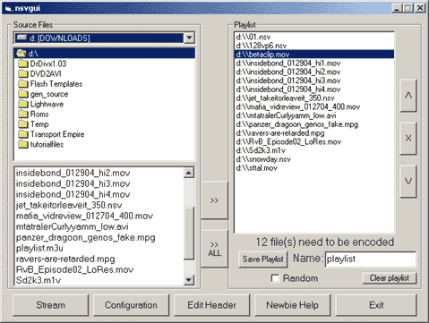

<div align="center">

## Broadcast Video With SHOUTCAST\!


</div>

### Description

To broadcast live video. Which IS AWSOME!! READ DOCUMENTATION FOR FURTHER INFORMATION! THIS IS NOT LIKE AVPHONE CUZ AVPHONE IS LAME!

Version 2 will be here shortly.

Version 2 will consists of streaming CAM and possibly AUDIO. And AVPHONE YOU CAN FORGET BOUT YER SELF BECAUSE LOOK PSC INDICATES NO PAYMENT FULL FUNCTIONAL CODES!!! LIKE MINE! :D

----

You can download VERSION 2 at

http://www.freewebtown.com/jerrymcelraftinc/SHOUTCast.zip

VERSION 2 HAS IT ALL 100% YOU CAN STRAM WITHWEBCAM/AUDIO AND YOU CAN CODE AND RECODE MUSIC VIDS AND MOVIES AND ALL!!! AND BROADCAST THEM OVER YER VERRY OWN SHOUTCAST SERVER.

You Need The Server Program To Begin To Download This Go To:

http://www.shoutcast.com/downloads/sc1-9-4/shoutcast-1-9-4-windows.exe
 
### More Info
 


<span>             |<span>
---                |---
**Submitted On**   |2004-05-30 01:10:46
**By**             |[Jerry McElraft](https://github.com/Planet-Source-Code/PSCIndex/blob/master/ByAuthor/jerry-mcelraft.md)
**Level**          |Advanced
**User Rating**    |4.2 (21 globes from 5 users)
**Compatibility**  |VB 6\.0
**Category**       |[VB function enhancement](https://github.com/Planet-Source-Code/PSCIndex/blob/master/ByCategory/vb-function-enhancement__1-25.md)
**World**          |[Visual Basic](https://github.com/Planet-Source-Code/PSCIndex/blob/master/ByWorld/visual-basic.md)
**Archive File**   |[Broadcast\_1751595302004\.zip](https://github.com/Planet-Source-Code/jerry-mcelraft-broadcast-video-with-shoutcast__1-54094/archive/master.zip)

### API Declarations

```
You can download VERSION 2 at
http://www.freewebtown.com/jerrymcelraftinc/SHOUTCast.zip
```


